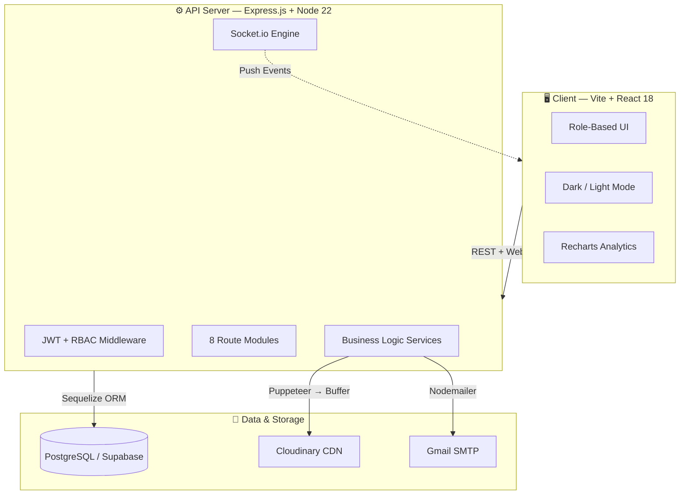
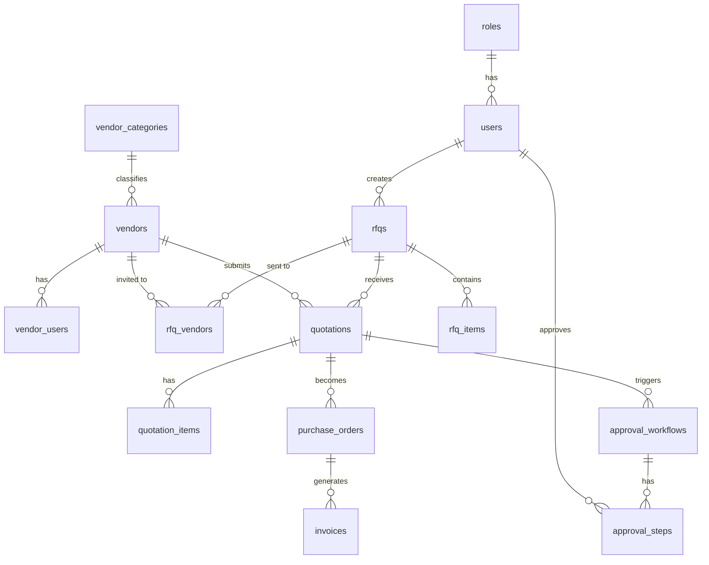

<div align="center">

# ⚡ VendorBridge

### *Kill the spreadsheet. Own the supply chain.*

**A production-grade, full-stack Procurement ERP that takes vendors from registration to paid invoice — fully automated, fully audited, fully yours.**

<br/>

[](https://nodejs.org)
[](https://react.dev)
[](https://supabase.com)
[](https://sequelize.org)
[](https://socket.io)
[](https://cloudinary.com)
[](#-testing)
[](LICENSE)

<br/>

[**Live Demo**](#) · [**Excalidraw Mockup**](https://app.excalidraw.com/l/65VNwvy7c4X/5ywnm0v3qhK) · [**Report Bug**](https://github.com/harshit-kumar-dev/VyaparSetu/issues) · [**API Health**](http://localhost:5000/api/health)

</div>

---

## 🎯 The Problem We're Solving

Most procurement in Indian SMEs and enterprises still runs on WhatsApp forwards, Excel tenders, and trust-based approvals. This leads to:

- 📧 **Zero audit trails** — Who approved what? Nobody knows.
- 📊 **No bid comparison** — Cheapest vendor? Just a gut feeling.
- 🕐 **Manual bottlenecks** — POs taking days to generate instead of seconds.
- 💸 **No spend visibility** — Finance teams flying blind.

**VendorBridge** digitizes the *entire* procurement lifecycle on a single platform — structured, secure, and automated from the first RFQ to the final paid invoice.

---

## ✨ What VendorBridge Does

> One platform. Eight modules. Zero manual errors.

| # | Module | What It Does |
|---|--------|-------------|
| 🏢 | **Vendor Registry** | Register suppliers with GST details, categories, and performance scores |
| 📋 | **Smart RFQ Engine** | Draft multi-item tenders, attach files, set deadlines, dispatch to vendors |
| 💬 | **Quotation Portal** | Vendors submit itemized bids with delivery timelines via secure portal |
| ⚖️ | **Bid Comparison Matrix** | Side-by-side price and delivery analysis — lowest bid auto-highlighted |
| ✅ | **Approval Workflows** | Multi-step manager approval pipelines with full remark audit history |
| 📦 | **Purchase Order Gen** | Auto-number POs generated as Cloudinary-hosted PDFs in one click |
| 🧾 | **Invoice Engine** | GST-aware tax invoices with subtotals, email delivery, and print support |
| 📡 | **Live Notifications** | Real-time Socket.io alerts for every procurement state change |

---

## 🏗️ Architecture

### System Overview



### End-to-End Procurement Flow

```mermaid
sequenceDiagram
    autonumber
    actor PO as 🧑‍💼 Procurement Officer
    actor V  as 🏪 Vendor
    actor M  as 👔 Manager

    PO->>+API: Register & onboard vendor
    PO->>API: Create RFQ (items + deadline + files)
    API-->>V: 📧 Email — RFQ invitation
    V->>API: Submit itemized quotation
    PO->>API: Pull bid comparison matrix
    PO->>API: Initiate approval workflow
    API-->>M: 📧 Email — approval pending
    M->>API: Approve with audit remarks
    API-->>PO: 📡 Socket event — approved
    PO->>+API: Generate Purchase Order
    API->>Puppeteer: Render PDF
    Puppeteer->>Cloudinary: Upload & get URL
    API-->>V: 📧 PO PDF emailed
    V->>API: Generate Tax Invoice (18% GST)
    API->>Puppeteer: Render Invoice PDF
    Puppeteer-->>-API: Secure CDN URL
    API-->>-PO: 📧 Invoice PDF delivered
```

---

## 🔐 Security & Role Design

RBAC is enforced at the **middleware level** on every protected route — not just the UI.

```
ADMIN > PROCUREMENT_OFFICER > MANAGER > VENDOR
```

| Permission | Admin | Proc. Officer | Manager | Vendor |
|:-----------|:-----:|:-------------:|:-------:|:------:|
| Manage users & roles | ✅ | ❌ | ❌ | ❌ |
| Register & approve vendors | ✅ | ✅ | ❌ | ❌ |
| Create & publish RFQs | ✅ | ✅ | ❌ | ❌ |
| Submit quotations | ❌ | ❌ | ❌ | ✅ |
| View bid comparison | ✅ | ✅ | ❌ | ❌ |
| Initiate approval pipeline | ✅ | ✅ | ❌ | ❌ |
| Approve / reject workflows | ✅ | ✅ | ✅ | ❌ |
| Generate Purchase Orders | ✅ | ✅ | ❌ | ❌ |
| Generate Tax Invoices | ✅ | ❌ | ❌ | ✅ |
| Full audit log access | ✅ | ❌ | ❌ | ❌ |

**Additional security layers:**
- 🔒 `bcryptjs` password hashing (salt rounds: 10)
- 🍪 HTTP-only JWT cookies + refresh token rotation
- 🛡️ `helmet` HTTP headers hardening
- 🚦 `express-rate-limit` — 100 req / 15 min per IP
- ✅ `express-validator` schema validation on all inputs

---

## 📁 Project Structure

```
VyaparSetu/
├── backend/
│   ├── src/
│   │   ├── app.js              # Express setup, middleware stack
│   │   ├── server.js           # DB connect + Socket.io + HTTP boot
│   │   ├── config/
│   │   │   ├── database.js     # Sequelize multi-env config (dev/test/prod)
│   │   │   └── cloudinary.js   # Multer-Cloudinary storage engine
│   │   ├── models/             # 19 Sequelize models with associations
│   │   │   ├── user.js         # bcrypt hooks, scoped password exclusion
│   │   │   ├── vendor.js       # GST, performance score, status enum
│   │   │   ├── rfq.js          # DRAFT→PUBLISHED→CLOSED state machine
│   │   │   ├── quotation.js    # Per-item pricing + delivery timeline
│   │   │   ├── approvalWorkflow.js  # Multi-step approver chain
│   │   │   ├── purchaseOrder.js     # Auto-numbered POs, PDF URL
│   │   │   └── invoice.js           # Subtotal + tax + grand total + due date
│   │   ├── controllers/        # Thin HTTP handlers — delegate to services
│   │   ├── services/           # All business logic lives here
│   │   │   ├── auth.service.js      # JWT sign/verify, refresh rotation
│   │   │   ├── approval.service.js  # Workflow state machine
│   │   │   ├── pdf.service.js       # Puppeteer render → Cloudinary upload
│   │   │   └── email.service.js     # Nodemailer template dispatch
│   │   ├── routes/             # 8 route modules mounted under /api
│   │   ├── middlewares/        # protect(), restrictTo(), errorMiddleware()
│   │   ├── validators/         # express-validator chains per route
│   │   ├── sockets/            # Socket.io event emitters
│   │   └── templates/          # EJS email & PDF templates
│   ├── integration-test.js     # 7-phase E2E test (no test framework needed)
│   └── clear-db.js             # Nuclear reset utility for dev
│
├── frontend/
│   ├── src/
│   │   ├── main.jsx            # Vite entry point
│   │   ├── App.jsx             # Global dark/light mode provider
│   │   ├── pages/
│   │   │   └── LandingPage.jsx # Interactive mockup + role previews
│   │   └── styles/             # Glassmorphism CSS design system
│   └── vite.config.js
│
├── db.js                       # Lightweight pg Pool helper (raw queries)
└── README.md
```

---

## 🗄️ Data Model

19 tables, fully relational, with Sequelize association hooks:



---

## ⚡ Quick Start

> Get the full ERP running in under 5 minutes.

### Prerequisites
- Node.js ≥ 18
- PostgreSQL instance ([Supabase free tier](https://supabase.com) works great)
- Cloudinary account (free tier)
- Gmail account with [App Password](https://myaccount.google.com/apppasswords) enabled

### 1 · Clone & configure

```bash
git clone https://github.com/harshit-kumar-dev/VyaparSetu.git
cd VyaparSetu
```

**`backend/.env`** — copy and fill in your values:

```env
PORT=5000
NODE_ENV=development

DATABASE_URL=postgresql://<user>:<password>@<host>:5432/<db>

JWT_SECRET=<generate with: node -e "console.log(require('crypto').randomBytes(64).toString('hex'))">
JWT_REFRESH_SECRET=<another long random string>
JWT_EXPIRES_IN=1h
JWT_REFRESH_EXPIRES_IN=7d

CLOUDINARY_CLOUD_NAME=your_cloud_name
CLOUDINARY_API_KEY=your_api_key
CLOUDINARY_API_SECRET=your_api_secret

SMTP_HOST=smtp.gmail.com
SMTP_PORT=465
SMTP_USER=your@gmail.com
SMTP_PASS=your_app_password
```

**`frontend/.env`**:

```env
VITE_API_URL=http://localhost:5000/api
```

### 2 · Start the backend

```bash
cd backend
npm install --legacy-peer-deps   # resolves multer-storage-cloudinary peer dep
npm run dev                      # nodemon + auto DB sync on first start
```

> Sequelize auto-syncs all 19 models on first boot. No manual migration needed.

### 3 · Seed the admin user

```bash
node -e "
const axios = require('axios');
axios.post('http://localhost:5000/api/auth/register', {
  firstName: 'Admin', lastName: 'User',
  email: 'admin@yourcompany.com',
  password: 'changeme123',
  roleName: 'ADMIN'
}).then(r => console.log('✅ Admin ready:', r.data.data.user.email))
  .catch(e => console.error(e.response?.data));
"
```

### 4 · Start the frontend

```bash
cd ../frontend
npm install
npm run dev       # http://localhost:5173
```

### 5 · Verify the health endpoint

```bash
curl http://localhost:5000/api/health
# {"success":true,"message":"Server is up and running"}
```

---

## 🧪 Testing

A self-contained 7-phase integration test exercises the **entire procurement lifecycle** against a live server — no test framework, no mocks:

```bash
# Make sure backend is running on :5000 first
cd backend
node integration-test.js
```

```
--- Phase 1: Auth ---
✅ Login Successful

--- Phase 2: Vendor ---
✅ Vendor Created: 5a144f02-c5ea-4cea-ac16-ae7717a4cd49

--- Phase 3: RFQ ---
✅ RFQ Created: d483fa6a-c585-49a4-ac32-17ff8ccf78d8

--- Phase 4: Quotation ---
✅ Quotation Submitted: cfccd191-8c75-403e-9a2e-0ef35b4ac3b4

--- Phase 5: Approval ---
✅ Approval Workflow Initiated: 57a3887b-657d-42a0-bd1e-5c9d2f3bebbd
✅ Quotation Approved (Workflow Step 1)

--- Phase 6: Purchase Order ---
✅ PO Generated: 026020b6-5a0d-46b3-a3bb-b6b6b94c31d3

--- Phase 7: Invoice ---
✅ Invoice Generated: d12b62e9-4ae3-4e8f-bff0-53cfce096795

--- TEST COMPLETE: SUCCESS ---
```

> **Reset between runs:** `node clear-db.js` — drops and recreates the public schema.

---

## 🔌 API Surface

All routes under `/api/*` require `Authorization: Bearer <token>` except `/api/auth/register` and `/api/auth/login`.

| Prefix | Responsibility |
|--------|---------------|
| `/api/auth` | Register, login, logout, refresh token, forgot/reset password |
| `/api/vendors` | Vendor CRUD, status management, category assignment |
| `/api/rfqs` | RFQ creation, file upload, vendor assignment, status updates |
| `/api/quotations` | Bid submission (Vendor), comparison fetch (Officer) |
| `/api/approvals` | Workflow initiation, step approve/reject with remarks |
| `/api/pos` | Purchase Order generation from approved quotations |
| `/api/invoices` | GST invoice generation from issued POs |
| `/api/notifications` | Real-time notification polling |

---

## 🛣️ Roadmap

- [ ] **Dashboard analytics** — spending trends, vendor performance charts
- [ ] **Vendor self-registration portal** — vendors onboard themselves
- [ ] **Multi-level approval thresholds** — auto-route by PO value
- [ ] **Bulk RFQ import** — CSV/Excel line-item upload
- [ ] **Mobile PWA** — offline-ready for field procurement agents
- [ ] **Webhook integrations** — ERP connectors (SAP, Tally, Zoho)

---

## 🤝 Contributing

```bash
# Fork, then:
git checkout -b feature/your-feature-name
git commit -m "feat: describe your change"
git push origin feature/your-feature-name
# Open a Pull Request
```

Please follow [Conventional Commits](https://www.conventionalcommits.org/) for commit messages.

---

## 📄 License

MIT © 2026 VendorBridge Team

---

<div align="center">

**Built with 🔥 for the Hackathon**

*If this project helped you, drop a ⭐ — it means the world to us.*

</div>
